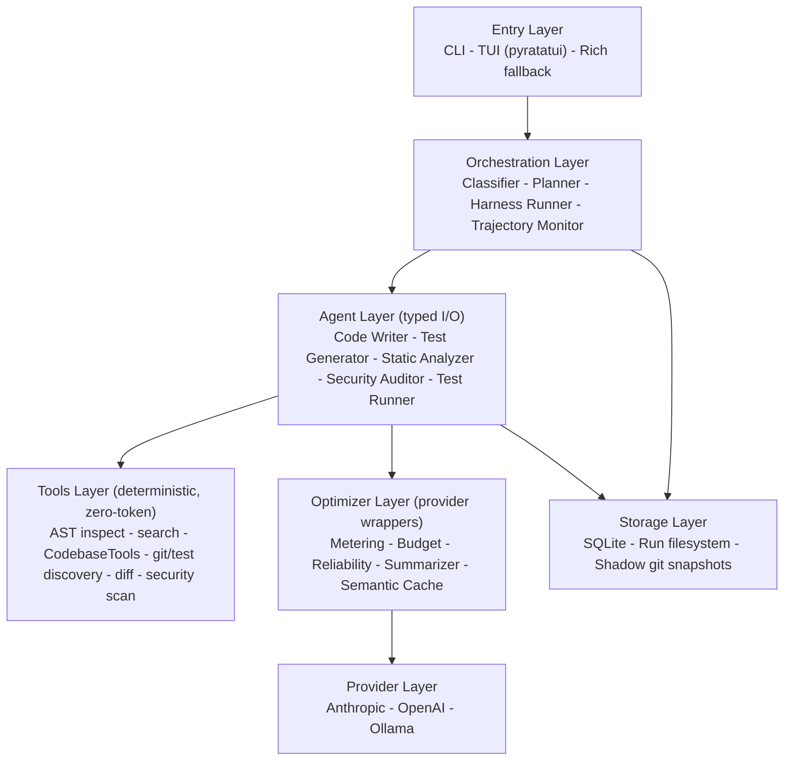
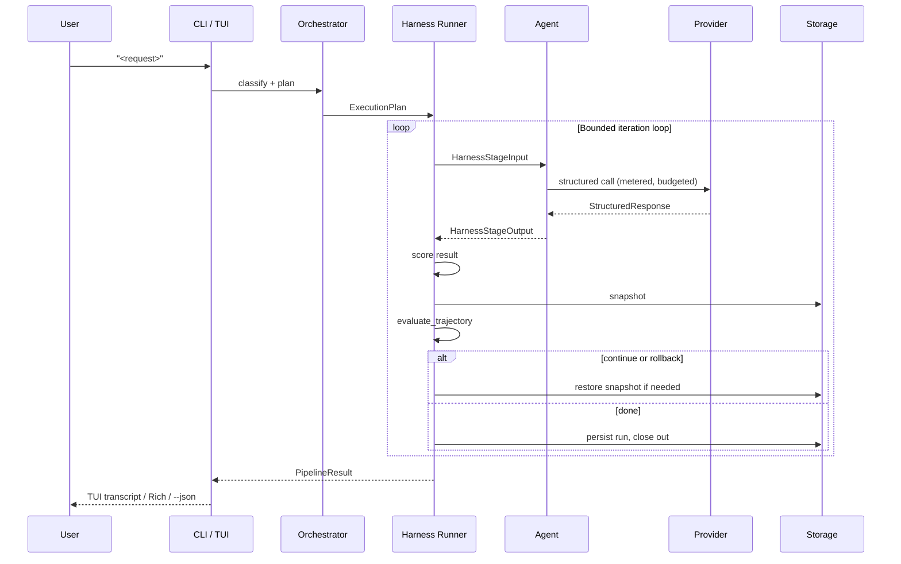

# Architecture

## Design Principles

The whole system is built around one core idea: **agents are typed function interfaces, not chat participants**. Each agent receives only a structured schema of what it actually needs, outputs a structured schema to the next stage, and the raw conversation history never bleeds forward. This is the central architectural commitment.

Three implications follow:

1. **Specialization through information minimalism.** Models are smarter when not distracted. A static analyzer that receives only `{code, language, intent}` produces sharper output than one that receives all that plus the user's original prompt and the writer's internal monologue.

2. **The orchestrator is the foreman, not the conveyor belt.** Agents don't pass data to each other directly. The orchestrator receives each agent's output, decides what the next agent needs, constructs that input schema, and invokes the next stage. Agents are stateless workers.

3. **Pipelines are bounded loops, not one-shot chains.** A request becomes a sized stage shape that runs to completion, gets scored, and either finishes or loops again with revision context. The orchestrator owns this loop, not the agents.

## The Agent Harness Model

Flug should be understood as an agent harness, not just a pipeline script. The harness is the runtime boundary that observes the world, curates context, invokes typed agents, records memory, executes actions, and escalates to the user when confidence or trajectory breaks down.

| Harness layer | Flug module ownership | Responsibilities | Status |
|---|---|---|---|
| Observation Layer | `tools/` (`ast_inspect`, `search`, `codebase`, `git_changes`, `test_discovery`, `security_scan`, `workspace`), `agents/test_runner.py` | Collect deterministic facts from code, tests, git, and security scans before asking an LLM. | Live |
| Context Layer | `orchestrator/context.py`, `optimizer/summarizer.py`, `storage/runs.py` | Fulfill bounded pull-based context requests through `CodebaseTools`, and turn prior stage outputs into small typed summaries instead of forwarding raw history. | Live |
| Agent Model Layer | `agents/`, `providers/`, `schemas/` | Invoke typed agent interfaces through provider adapters and validate every response against Pydantic schemas. | Live |
| Actions Layer | `orchestrator/runner.py`, `tools/file_changes.py`, `storage/filesystem.py` | Apply file changes, run subprocesses, write artifacts, and execute deterministic commands through explicit action boundaries. | Live |
| Memory Layer | `storage/` (SQLite + run filesystem + shadow-git snapshots), `optimizer/cache.py` | Persist run/iteration history, snapshot every pass for rollback, and cache reusable stage results. | Live (no memory-updater / project `context.md` yet) |
| Supervisor Feedback and Escalation | `orchestrator/trajectory.py` | Compute a deterministic state vector after every iteration, detect cycles/oscillation/regression/confidence-collapse, and recover or abort with a structured `FailureReport`. | Live |

The orchestrator is the harness supervisor. It decides which layer to use next. Agents do not reach directly into memory, tools, providers, or UI; they receive typed input, return typed output, and the harness decides how that output affects the run.

## Architecture Today

Two views of the same system: how the modules are layered, and how a single request actually moves through them.

### Layered view



Every arrow above crosses a typed Pydantic schema boundary (`flug/schemas/`). Nothing passes between layers as a raw dict or string; that constraint is load-bearing enough to be a design principle (see above), not just an implementation detail, so it isn't drawn as its own node.

### Request lifecycle (one turn)



The stage shape inside the loop depends on the classifier's tier (`flug/optimizer/budget.py::stage_names_for_tier`):

| Tier | Live stages, in order |
|---|---|
| Trivial | Code Writer |
| Light | Code Writer, Static Analyzer, Test Runner |
| Standard | Code Writer, Test Generator, Static Analyzer, Test Runner |
| Substantial / Architectural | Code Writer, Test Generator, Static Analyzer, Security Auditor, Test Runner |

### Design phase (Week 4, live)

Not wired into the live planner yet; see `03-design-phase.md` and `ROADMAP.md` Week 4 (checkpoints 4A-4G) for the full design and build order. Summary: the design phase is the front half of the SDLC, run as a human-gated, loopable pipeline, not a fixed automated chain.

```
User
  │
  ▼ ── DESIGN PHASE (planned, human-gated, loopable) ──
┌────────────────────────────┐
│ Conversation                │  free exploration: brief -> sketch -> deepen,
│ (untyped, multi-turn)       │  escalates on the user's say-so
└──────────────┬──────────────┘
               │ user says "make the plan"
               ▼
┌────────────────────────────┐
│ Crystallization              │  one structured-output call -> DesignPlan
│ (typed handoff boundary)    │  (the only typed point in this phase)
└──────────────┬──────────────┘
               ▼
┌────────────────────────────┐
│ Adversarial Plan Critic     │  fresh context, hostile review of the
│ (typed, can loop back up)   │  concrete plan; user-gated, can repeat
└──────────────┬──────────────┘
               │ user accepts
               ▼ ── EXECUTION PHASE (live today, see the loop above) ──
   One iteration loop run per Task in the DesignPlan, in dependency order
```

Bare `flug` is planned to become the single human entry point that opens
directly into the conversation by default. A `DesignPlan` can also be
ingested directly (hand-authored or pasted from elsewhere), independent of
the conversational UI. Either way, the output (a `DesignPlan`, optionally
carrying a `TechnicalSpec`) drives the live loop above one task at a time; it
does not replace the loop.

## Schema-as-Contract

Every agent input and output is a Pydantic v2 `BaseModel`. The schema is simultaneously:

- The validation rule for LLM output
- The cache key for semantic caching
- The audit record stored to SQLite
- The wire format for serialization
- The TypeScript-style type hint for any agent that consumes it

One definition, four jobs. Example:

```python
class CodeWriterOutput(BaseModel):
    code: str
    language: str
    intent: str                       # 1-2 sentence summary, not full prompt
    dependencies: list[str]
    known_limitations: list[str]      # agent self-reports uncertainty
    confidence: float = Field(ge=0, le=1)

class StaticAnalyzerInput(BaseModel):
    code: str
    language: str
    intent: str
    # does NOT receive original user message or writer's reasoning
```

Pydantic v2 specifically because:
- Strict validation at boundary crossings (catches malformed LLM output immediately)
- Native `model_json_schema()` for feeding to LLM structured-output APIs
- Native `model_dump_json()` and `model_validate_json()` for wire serialization
- Compiled in Rust, ~10x faster than v1

## The Agent Roster

| Agent | Receives | Produces | Default Model | Status |
|---|---|---|---|---|
| Classifier | Distilled request intent | `ComplexityClassifierOutput` (tier, risk domains) | nano | Live |
| Planner | Classifier output | `ExecutionPlan` (stage shape, budgets) | nano | Live |
| Code Writer | Distilled intent, pulled file context, revision context | `CodeWriterOutput` | medium | Live |
| Test Generator | Code Writer summary, pulled file context, revision context | `TestGeneratorOutput` | medium | Live |
| Static Analyzer | Changed/written code, language, intent | `StaticAnalyzerOutput` | nano | Live (deterministic checks first; LLM interpretation optional) |
| Security Auditor | Git-changed files, Bandit findings | `SecurityAuditorOutput` (severity-grouped) | nano | Live (deterministic Bandit-first, graceful degradation if absent) |
| Test Runner | Discovered test command, project workspace | `TestRunResults` | (deterministic, no model) | Live |
| Design Conversation | User brief, context, knowledge base files | Free-form, crystallizes to `DesignPlan` on request | medium/large | Live (4E) |
| Plan Critic | `DesignPlan` (fresh context) | `PlanCritique` | large | Live (4D) |
| Code Reviewer | Summaries of all prior stages | `ReviewOutput` | small | Planned (post-Week 4) |
| Reporter | All structured outputs | `FinalReport` | nano | Planned (post-Week 4) |

Tier names map to actual models via the model registry (see `06-multi-provider.md`). Defaults can be overridden per-stage via config (see `07-agent-configuration.md`).

## What Each Agent Sees (Information Flow)

This table is the canonical reference for context routing.

| Agent | Receives | Does NOT receive |
|---|---|---|
| Classifier / Planner | Distilled request intent | The user's full verbatim message |
| Code Writer | Distilled intent, bounded pulled file context, revision context on later iterations | User's verbose original message, other agents' internal reasoning |
| Test Generator | Code Writer's bounded summary, pulled file context | Static analysis or security findings (irrelevant to test design) |
| Static Analyzer | Changed code, language, a one-sentence intent | User request, writer's reasoning |
| Security Auditor | Git-changed files, deterministic Bandit findings | Test results, lint issues |
| Test Runner | A discovered test command and the project workspace | Anything else (deterministic, no model) |

Nothing flows forward unconditionally. Every field in every input schema is a deliberate choice.

## Why Not LangChain / CrewAI / AutoGen

These frameworks abstract away exactly the parts that need to be controlled:

- **Token flow**: framework-managed history accumulation is the single biggest source of token waste. We need explicit, per-agent context curation.
- **Schemas**: most frameworks pass dicts or strings between agents. Strict typing is non-negotiable for a system that needs to be both correct and cheap.
- **Routing**: built-in chain abstractions are linear. Real pipelines branch, loop, and skip stages.
- **Observability**: framework traces are opaque. Direct OTel/Langfuse integration with our own span schema is cleaner.

The orchestrator, optimizer, and harness runner have grown well past a weekend toy (the iteration loop, trajectory monitor, and token optimizer alone are over 2,000 lines), but every line of it is plain Python we own and can read end to end. That is the trade we are making: more code to maintain ourselves, in exchange for total visibility into where tokens go and why a run did what it did.

## Iteration and Loops

The pipeline is not one pass; it is a bounded loop (see the sequence diagram above and `05-trajectory-monitor.md` for full detail):

- Every iteration is snapshotted to a shadow git repository before stages run (`storage/snapshot.py`), separate from the user's real `.git`.
- After the stages run, `compute_iteration_state` and `compute_score` build a deterministic, severity-weighted state vector (`orchestrator/trajectory.py`).
- `evaluate_trajectory` checks six rules: hard iteration limit, token budget, two-state oscillation, repeated-state cycling, cascading regression, and confidence collapse.
- Recovery actions (rollback, step-back, cycle/oscillation escalation) restore the best-scoring snapshot and continue with a compact `revision_context` threaded into the next pass's `HarnessStageInput`.
- Terminal aborts (hard limit, budget, wall time) build a structured `FailureReport` with per-iteration attempts instead of grinding silently.
- Defaults: `max_iterations=5`, `max_wall_seconds=300`.

## Parallel Execution (Planned, Not Implemented)

Some stages don't depend on each other; static analysis and the security audit both depend only on the code, so they could in principle run concurrently within a pass. The current harness runner executes the stage shape sequentially within each iteration. Dispatching independent stages concurrently is a latency optimization worth revisiting once the sequential loop's correctness and trajectory behavior are well understood; it is not on the Week 3/4 critical path and is not built today.
